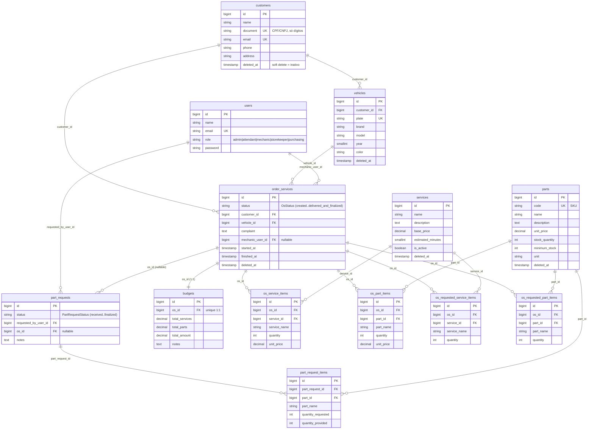

# Diagrama ER — Oficina Mecânica

Modelo relacional da aplicação (PostgreSQL 16 no RDS), extraído das migrations do monorepo. Apenas tabelas de domínio (tabelas de framework — `cache`, `jobs`, `sessions`, `password_reset_tokens`, `personal_access_tokens`, `migrations` — foram omitidas).

> **Notas importantes**
> - `customers.document` guarda **CPF (11) ou CNPJ (14)**, só dígitos, `unique`. **Não há coluna `cpf`.** A autenticação por CPF (repo 1) consulta por `document`.
> - Não existe coluna `status`/`ativo` em `customers`: "inativo" = **soft delete** (`deleted_at`).
> - As colunas `status` (`order_services`, `part_requests`) são **strings** com valores definidos por enums PHP, não enums de banco.

## Ciclo de vida da OS (`order_services.status`)

Valores persistidos (enum `OsStatus`): `created` → `in_analysis` → `pending_approval` → (`in_renegotiation`) → `approved`/`rejected` → `in_execution` → `execution_finished` → `delivered_and_finalized`.

Existe um vocabulário público derivado (`PublicOsStatus`: recebida, diagnóstico, aguardando aprovação, execução, finalizada, entregue) usado nos dashboards de negócio (tempo médio por status), **não persistido** no banco.
